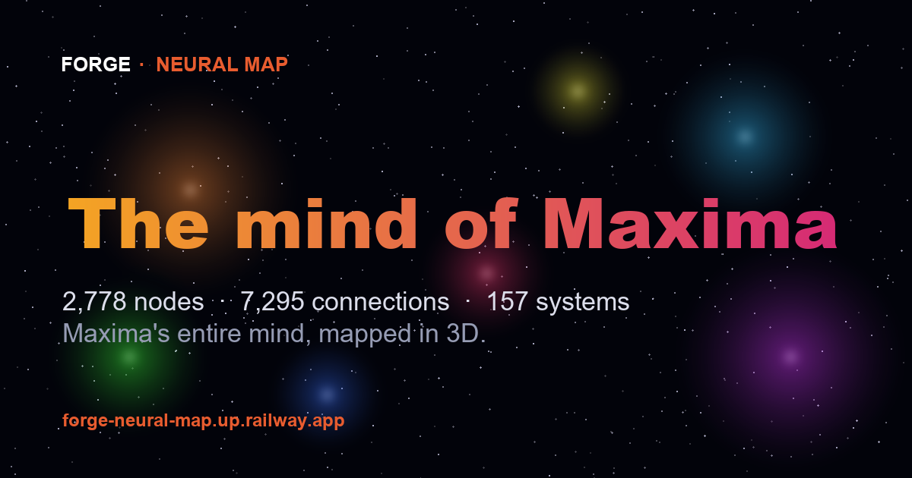

<h1 align="center">FORGE · Neural Map</h1>
<p align="center"><strong>The mind of Maxima</strong> — an explorable 3D universe of an AI's mind, narrated by the AI herself.</p>

<p align="center">
  <a href="https://github.com/Lancimoun/forge-neural-map/actions/workflows/ci.yml"></a>
  
  
  
  
  
  
</p>

<p align="center">
  <a href="https://forge-neural-map-production.up.railway.app"><strong>▶ Live demo</strong></a> <em>(sound on)</em> ·
  <a href="#what-it-is">What it is</a> ·
  <a href="#how-its-built">How it's built</a> ·
  <a href="#verify-a-release">Verify</a>
</p>

---



I took **Maxima** — a production AI agent built at [FORGE](https://forge-landing-production.up.railway.app) — and rendered her entire codebase as an explorable galaxy. Then I made *her* your guide through it.

## What it is
- **2,778 nodes · 7,295 connections · 157 systems** — every function and file in her code, mapped from a real knowledge graph and drawn as a star field.
- **Five scales of exploration:** fly the galaxy → warp into a star → orbit its planets → drop to a planet's surface → zoom out to a universe of sibling galaxies (Memory, Voice, Reasoning, Soul, Dreams).
- **Maxima narrates it** — a cinematic, voiced guide (Web Speech) that welcomes you and explains what each part of her is.
- **Watch Maxima think** — six guided prompts illuminate real routing paths; optional live mode stays private and key-gated in the browser.
- **The Neural Web** — toggle the real 7,295 connections and watch her mind light up as a firing brain.
- **Accessible search and flight telemetry** — a persistent search label, announced results, keyboard flight state, live velocity/range/vector readouts, responsive controls, and reduced-motion protection.
- Hidden discoveries, a visitor constellation, a codex, comets, a black hole at the core, **free-flight** (WASD), a cinematic record mode, an evolving procedural score, saved progress, and deep-link sharing.

## How it's built
- **Vanilla three.js (r128)** + custom **GLSL vertex shaders** for the live orbital animation — no game engine.
- A pure-Python bake (`bake.py`) turns a code knowledge-graph into a compact `nodes.json`: a spiral-galaxy layout with community detection and per-node orbital parameters.
- **UnrealBloom** + **ACES** filmic tone-mapping for the cinematic look.
- Procedural ambient score + narration via the **Web Audio** & **Web Speech** APIs.
- Shipped as a static site (nginx) on **Railway**.
- A stdlib-only regression suite locks the 2,778-node truth claims, production interaction hooks, accessible search, and cinematic flight contracts.

> Note: the raw `graph.json` (the source knowledge-graph of the private codebase) isn't included — `nodes.json` is the baked, public-facing output that powers the demo.

## Run it
```bash
docker build -t neural-map .
docker run -p 8080:8080 -e PORT=8080 neural-map
```
…or serve the folder statically and open `index.html`.

## Verify a release
After a deployment, run the same provider-free contract used in CI against the
public static artifacts:

```bash
python verify_release.py
```

The verifier performs only two read-only GETs (`/` and `/nodes.json`). It checks
the accessible search and flight telemetry, the recovered Ask Maxima / visitor
star / thought-HUD hooks, reduced-motion behavior, and the exact
**2,778 / 7,295 / 157** graph counts. It does not submit a form, use an API key,
or call an AI provider. Use `--base-url http://localhost:8080` for a local
container or static server.

## Stack
`three.js` · `GLSL` · `Web Audio API` · `Web Speech API` · `Python` · `Docker` · `nginx` · `Railway`


## Further reading

[**Writing on AI reliability**](https://lancimoun.github.io/writing/) — how autonomous systems fail quietly, and the mechanisms that catch them. Every incident dated, with the measurements.

---
Built by **[Architect L.](https://github.com/Lancimoun)** · part of **FORGE** — building AI you can watch think.
